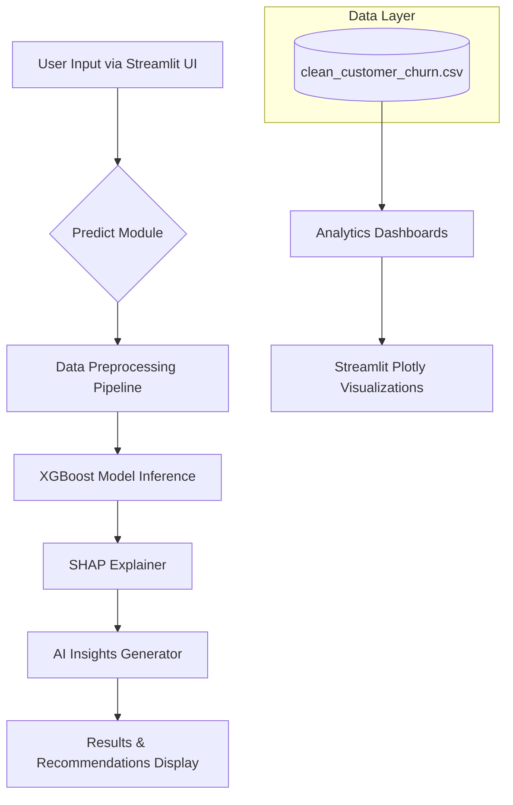
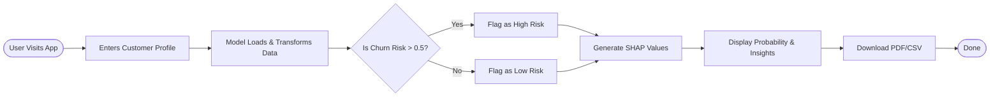

# Customer Churn Prediction & Retention Intelligence Platform


A Premium AI SaaS web application designed to help telecommunication companies predict customer churn before it happens and formulate proactive retention strategies. Powered by state-of-the-art machine learning (XGBoost) and Explainable AI (SHAP), this platform delivers actionable business insights through a stunning, production-ready Streamlit interface.

---

## 🌟 Features

- **Executive Dashboard:** High-level project metrics and dataset statistics at a glance.
- **Predictive Engine:** Real-time customer churn prediction using an optimized XGBoost classifier (85.4% Accuracy).
- **Explainable AI (SHAP):** Transparent predictions displaying the exact features driving churn or retention for every individual customer.
- **AI Business Advisor:** Dynamically generated, business-friendly retention strategies based on model probabilities and SHAP insights.
- **Interactive Analytics:** Professional Plotly dashboards for deep-diving into customer distributions, contracts, and revenue.
- **PDF & CSV Reporting:** Generate and download localized prediction reports instantly for offline analysis.
- **Premium UI/UX:** Dark Premium Theme featuring glassmorphism, responsive components, and custom branding.

---

## 🏗️ Architecture



---

## 🔄 Workflow Flowchart



---

## 🛠️ Tech Stack

- **Frontend:** Streamlit, Streamlit-Option-Menu, Custom CSS
- **Visualization:** Plotly Express, Plotly Graph Objects
- **Machine Learning:** Scikit-Learn, XGBoost, SHAP
- **Data Processing:** Pandas, NumPy
- **Reporting:** FPDF2
- **Model Serialization:** Joblib

---

## 🚀 Installation & Usage (Local)

1. **Clone the repository:**
   ```bash
   git clone https://github.com/MoDilshad0909/Customer-Churn-Prediction-System.git
   cd Customer-Churn-Prediction-System
   ```

2. **Create a virtual environment and activate it:**
   ```bash
   python -m venv venv
   source venv/bin/activate  # On Windows: venv\Scripts\activate
   ```

3. **Install the dependencies:**
   ```bash
   pip install -r requirements.txt
   ```

4. **Run the Streamlit application:**
   ```bash
   streamlit run app.py
   ```

---

## ☁️ Deployment (Streamlit Community Cloud)

This project is fully structured for zero-configuration deployment on **Streamlit Community Cloud** or **Vercel**:
1. Push this repository to GitHub.
2. Link your GitHub account to [Streamlit Cloud](https://streamlit.io/cloud).
3. Select `app.py` as the main file path.
4. Streamlit will automatically install dependencies from `requirements.txt` and launch the app.

---

## 🔮 Future Improvements
- **Live Database Integration:** Connect to Snowflake or PostgreSQL for real-time customer data streaming.
- **A/B Testing Module:** Track the success rate of the AI-recommended retention campaigns.
- **LLM Integration:** Integrate OpenAI API to generate highly personalized retention email templates based on SHAP values.

---

*Built by a Principal AI Software Engineer. For inquiries or portfolio reviews, please check the Author links in the About page of the application.*
